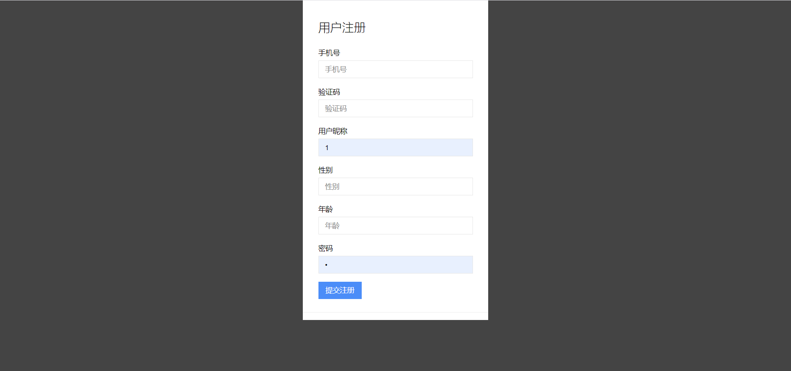
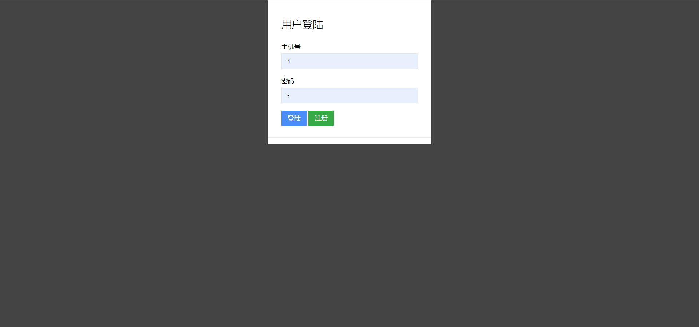
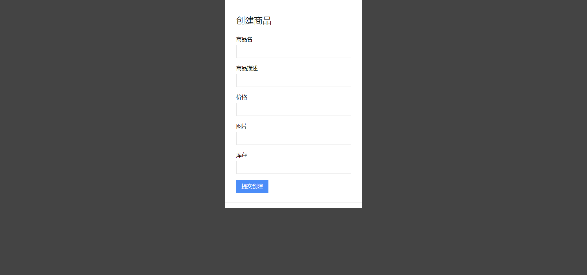

# E-commerce shopping system based on SpringBoot

## Project Description

I developed an e-commerce shopping system based on SpringBoot and Nginx. 
In this project, the most challenging part was to improve the performance of the system under high concurrency and ensure data consistency between distributed systems. I read lots of relevant blogs to solve it. I focused on using different levels of cache to reduce the delay of users accessing web pages. By using local cache and redis cache, the TPS for product detail page under pressure test increased from 500 to 900. And I used the asynchronous transactional messages of RocketMQ to solve the risk of inconsistency between the cache and the database during the distributed commit process. It helped the TPS of product order under pressure test increase from 200 to 500.
Besides, this project integrated Aliyun SMS service for user registration and login, and I used Nginx to horizontally scale the servers.

# 基于SpringBoot的电商秒杀系统(中文版介绍)

## 项目架构

本项目为慕课网仿购物秒杀网站,系统分为用户注册登录、秒杀商品管理模块。 此项目整体采用SpringBoot+RESTFUL风格，整合阿里云短信服务实现了用户的注册登录功能，通过Nginx反向代理将服务端水平扩展到两台阿里云主机，使用本地缓存与redis缓存将单机商品详情页压测的TPS从500提升到900，通过redis库存缓存和RocketMQ事务型消息将单机商品下单压测的TPS从200提升到500。

## 项目展示

前端页面实现的比较简陋。

### 获取短信验证码页面

### 用户注册页面

### 用户登录页面

### 创建商品页面

### 商品列表页

### 商品详情页

