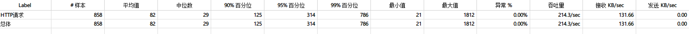
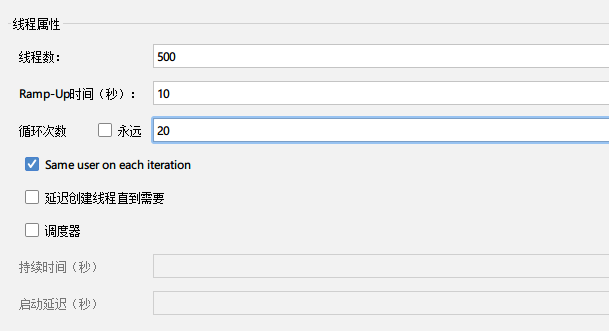
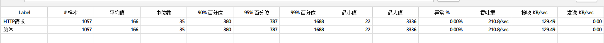
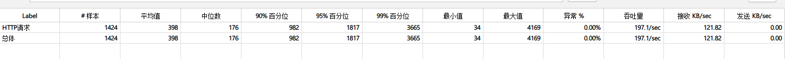
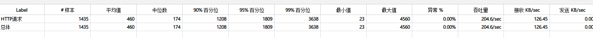
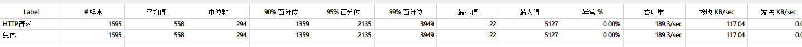
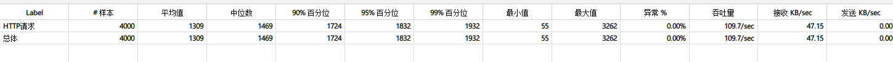
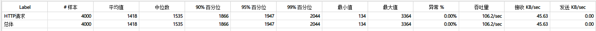

## 云端部署

部署过程没大问题，百度安装开发环境即可。

## 压测

一开始压测的TPS只有30左右，找了挺久的，一开始以为是数据库没有设置对应index，设置后TPS略有上升但还是30多。后来仔细对比龙虾三少的代码感觉代码逻辑没有问题，应该不至于和视频中TPS相差十倍...后来想到是不是带宽不够，本来想将带宽升到50M试试，后来看了一下视频发现视频的配置也是1M。这个时候感觉问题可能在数据库的连接上了，于是查看yml文件，发现龙虾三少的代码里配置的是127.0.0.1，而我的是公网ip，于是改成127.0.0.1后将jar包部署到服务器上重新进行压测，这次发现TPS可以达到200左右了。

## nginx代理后压测TPS对比

此时Nginx代理服务器与数据库服务器的带宽都是1M，视频里好像为了降低带宽的影响将数据库服务器的带宽升级成20M，Nginx设置成25M。

线程组设置：

### 数据库服务器效果

### nginx效果

### 基于token的分布式会话实现

实现分布式会话时，本地测试登录效果时otpcode无法设置到session中，百度后发现是Chrome设置不知道怎么改变了，按照博客更改设置后成功。

[谷歌浏览器跨域后request.getsession.getAttribute()获取不到,其他浏览器可以获取到值](https://blog.csdn.net/Meng_kiss/article/details/112612193)

## 缓存

### redis缓存

对商品详情页使用redis缓存后，

感觉现在压测的瓶颈是带宽，服务器的带宽都是1Mbps，也就是125Kb/s，压测时接受的速率也差不多为120kb/s。以后可以试着升级带宽再压测一下。

### 本地guava缓存

对商品详情页使用guava cache后，

## CDN

因为没有买域名，所以CDN部分只能先看一下视频理解一下，以后有机会再实操。

## 交易性能优化

### 交易验证性能优化

这里一开始进行压测时总是报错，duplicate key，debug一段时间才发现问题出在sequence生成orderId的代码上。
原来的逻辑是先取出sequence，加上step后save，但这样如果有两个线程取出sequenceInfo，一个save后另一个也save，得到的orderId相同，在订单入库时就会出错。一开始以为jpa和视频中mybatis一样不会出问题，先改成根据时间和随机数生成随机id，发现这样没问题才确定问题在jpa更新的逻辑上，于是最后修改代码完成压测。

使用KeyUtil的随机id的压测结果：

修改jpa更新逻辑后的压测结果:

### rocketmq异步扣减库存

rocketmq异步扣减库存时出现了一点问题，是服务器上mq启动配置的问题，可以参考[本地连接服务器上rocketmq 出现closeChannel: close the connection to remote address[] result: true](https://blog.csdn.net/lwycc2333/article/details/106629237)