## 并发容量问题

### server端并发线程数上不去

查看SpringBoot配置
spring-configuration-metadata.json文件下
查看各个节点的配置

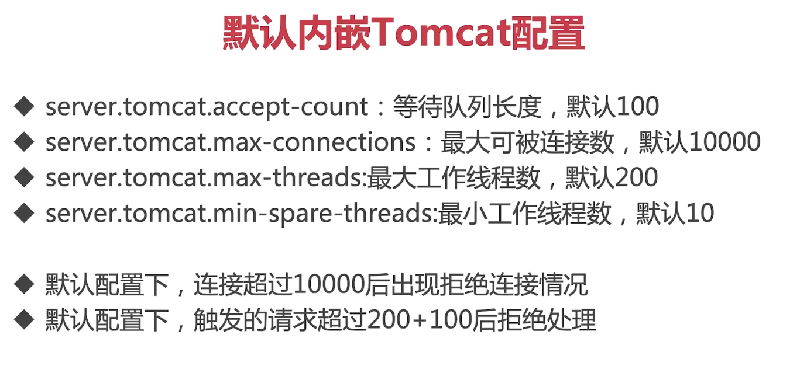

### 定制化内嵌Tomcat开发

keepAliveTimeOut：多少毫秒后不响应的断开keepalive
maxKeepAliveRequests：多少次请求后keepalive断开失效

使用WebServerFactoryCustomizer《ConfigurableServletWebServerFactory》定制化内嵌tomcat配置

```java
@Component
public class WebServerConfiguration implements WebServerFactoryCustomizer<ConfigurableWebServerFactory> {

    @Override
    public void customize(ConfigurableWebServerFactory factory) {
        // 使用对应工厂类提供给我们的接口定制化tomcat connector
        ((TomcatServletWebServerFactory) factory).addConnectorCustomizers(new TomcatConnectorCustomizer() {
            @Override
            public void customize(Connector connector) {
                Http11NioProtocol protocol = (Http11NioProtocol) connector.getProtocolHandler();
                // 定制化keepAliveTimeout，设置30秒内没有请求服务端自动断开keepalive连接
                protocol.setKeepAliveTimeout(30000);
                // 当客户端发送超过10000个请求则自动断开keepalive连接
                protocol.setMaxKeepAliveRequests(10000);
            }
        });
    }
}
```

### 发现容量问题

响应时间变长，TPS上不去

单Web容器上限：
* 线程数量：4核cpu 8G内存单进程调度线程数800-1000以上之后会花费巨大的时间在cpu调度上；
* 等待队列长度：队列做缓冲池用，但也不能无限长，消耗内存，出队入队也消耗cpu，一般1000-2000左右

Mysql数据库QPS容量问题：

* 主键查询：千万级别数据=1-10毫秒
* 唯一索引查询：千万级别数据=10-100毫秒
* 非唯一索引查询：千万级别数据=100-1000毫秒
* 无索引：百万条数据=1000毫秒+

MySQL数据库TPS容量问题：
* 非插入更新删除操作：同查询
* 插入操作：1w-10w tps（依赖配置优化）

## 解决容量问题

### Nginx反向代理负载均衡

* 单机容量问题，水平扩展
* nginx反向代理
* 负载均衡配置

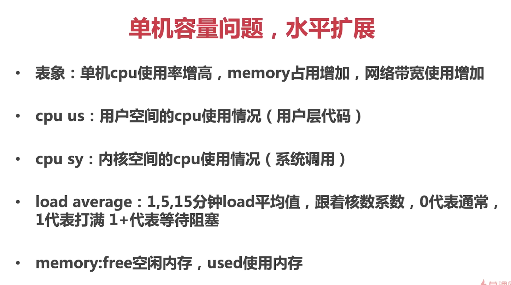

解决方案：
* MySQL数据库开放远端连接；
* 服务端水平对称部署；
* 验证访问；

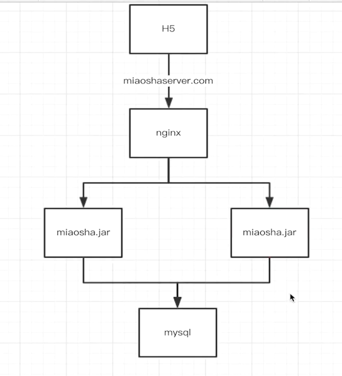

#### 数据库远程开放端口连接

对于数据库的访问，需要进行授权，进入mysql数据库，查看user表，进行修改以允许对应ip访问。

```
grant all privileges on *.* to  root@'%' identified by 'root'

flush privileges;
```

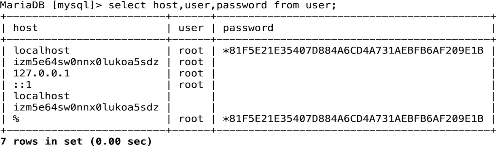

#### nginx

Nginx用途：
* 使用Nginx作为web服务器；
* 使用Nginx作为动静分离服务器；
* 使用Nginx作为反向代理服务器；

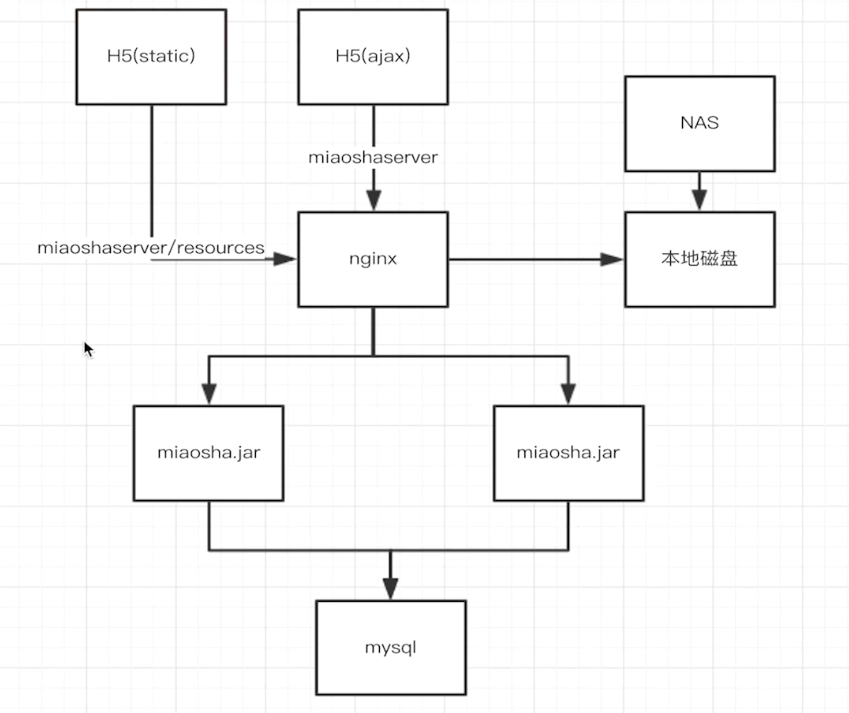

#### nginx web服务器

* location节点path：指定url映射key
* location节点内容：root指定location path后对应的根路径，index指定默认的访问页；
* sbin/nginx -c confi/nginx.conf启动
* 修改配置后直接sbin/nginx -s reload无缝重启

#### Nginx动静分离服务器

* location节点path特定resources:静态资源路径
* location节点其他路径：动态资源用

#### Nginx做反向代理服务器

* 设置upstream server
* 设置动态请求location为proxy pass路径
* 开启Tomcat access log验证

```conf
upstream backend_server{
        server 172.17.100.241 weight=1;
        server 172.17.100.242 weight=1;
    }

location / {
            proxy_pass http://backend_server;
            proxy_set_header Host $http_host:$proxy_port;
            proxy_set_header X-Real-IP $remote_addr;
            proxy_set_header X-Forwarded-For $proxy_add_x_forwarded_for;
        }
```

```java
server.tomcat.accesslog.enabled=true
server.tomcat.accesslog.directory=/var/opt/miaosha/tomcat
server.tomcat.accesslog.pattern=%h %l %u %t "%r" %s %b %D
```

%h:remote_host，远端host地址
%u:remote_user,远端主机user
%t:处理时长
%r:http请求的第一行
%s:http的返回状态码
%b:bytes_send,response的大小
%D:处理请求的时长

Nginx与server的连接默认是短链接，可以通过配置文件设置keepalive，因为默认采取的是http1.0协议
```nginx
upsteam backend_server {
    server 172.31.49.158 weight=1;
    server 172.31.49.159 weight=1;
    keepalive 30;
}

location / {
    proxy_http_version 1.1;
    proxy_set_header Connection "";
}
```

#### Nginx高性能原因

* epoll多路复用（解决了IO阻塞回调通知问题）
* master worker进程模型（平滑地重启）
* 协程机制

多路复用进化过程：
* java bio模型，阻塞进程式；
* Linux select模型，变更触发轮训查找，有1024数量上限
* epoll模型，变更触发回调直接读取，理论上无上限；

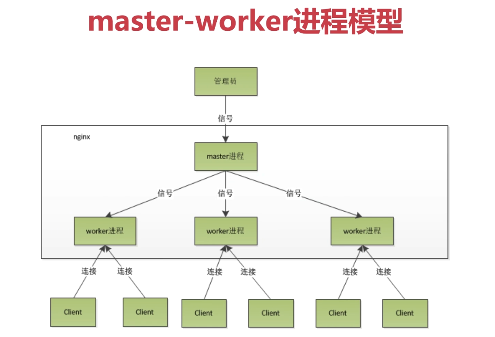

协程机制：
* 依附于线程的内存模型，切换开销小；
* 遇阻塞即归还执行权，代码同步；
* 无需加锁；

### 会话管理

* 基于cookie传输sessionid：java Tomcat容器session实现
* 基于token传输类似sessionid:java代码session实现

#### 分布式会话

* 基于cookie传输sessionid：java tomcat容器session实现迁移到redis；
* 基于token传输类似sessionid：java代码session实现迁移到redis

## 缓存设计

* 用快速存取设备，用内存
* 将缓存推到离用户最近的地方
* 脏缓存清理

### 多级缓存

* redis缓存
* 热点内存本地缓存
* nginx proxy cache缓存
* nginx lua 缓存

```java
@Configuration
public class RedisConfig {
    @Bean
    public RedisTemplate redisTemplate(RedisConnectionFactory redisConnectionFactory){
        RedisTemplate redisTemplate = new RedisTemplate();
        redisTemplate.setConnectionFactory(redisConnectionFactory);

        //首先解决key的序列化方式
        StringRedisSerializer stringRedisSerializer = new StringRedisSerializer();
        redisTemplate.setKeySerializer(stringRedisSerializer);

        //解决value的序列化方式
        Jackson2JsonRedisSerializer jackson2JsonRedisSerializer = new Jackson2JsonRedisSerializer(Object.class);

        ObjectMapper objectMapper =  new ObjectMapper();
        // 设置NON_FINAL可以在json序列化时带上class信息，否则在反序列化时会报错cannot cast
        objectMapper.activateDefaultTyping(LaissezFaireSubTypeValidator.instance,
                ObjectMapper.DefaultTyping.NON_FINAL, JsonTypeInfo.As.PROPERTY);
        jackson2JsonRedisSerializer.setObjectMapper(objectMapper);
        redisTemplate.setValueSerializer(jackson2JsonRedisSerializer);

        return redisTemplate;
    }
```

#### 本地热点缓存

* 热点数据
* 脏读非常不敏感
* 内存可控

#### Guava cache

* 可控制的大小和超时时间
* 可配置的LRU策略
* 线程安全

缺点：

* jvm容量大小限制
* 过期淘汰问题

#### Nginx proxy cache缓存

* Nginx反向代理前置
* 依靠文件系统存索引级的文件
* 依靠内存缓存文件地址

#### nginx lua

* lua协程机制
* Nginx协程机制
* Nginx lua插载点
* OpenResty

Nginx协程：

* Nginx的每一个Worker进程都是在epoll或kqueue这种时间模型之上，封装成协程
* 每一个请求都有一个协程进行处理
* 即使ngx_lua需要运行lua，相对C有一定的开销，但依旧能保证高并发能力

Nginx协程机制：
* Nginx每个工作进程创建一个lua虚拟机；
* 工作进程内的所有协程共享同一个vm；
* 每个外部请求由一个lua协程处理，之间数据隔离；
* lua代码调用io等异步接口时，协程被挂起，上下文数据保持不变
* 自动保存，不阻塞工作进程
* io异步操作完成后还原协程上下文，代码继续执行

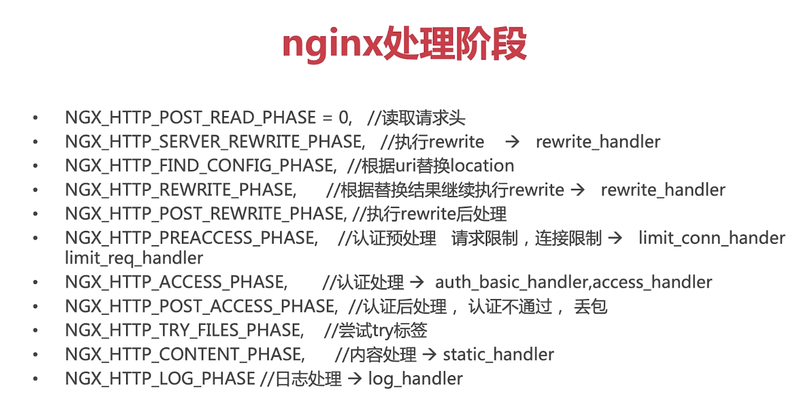

Nginx插载点:

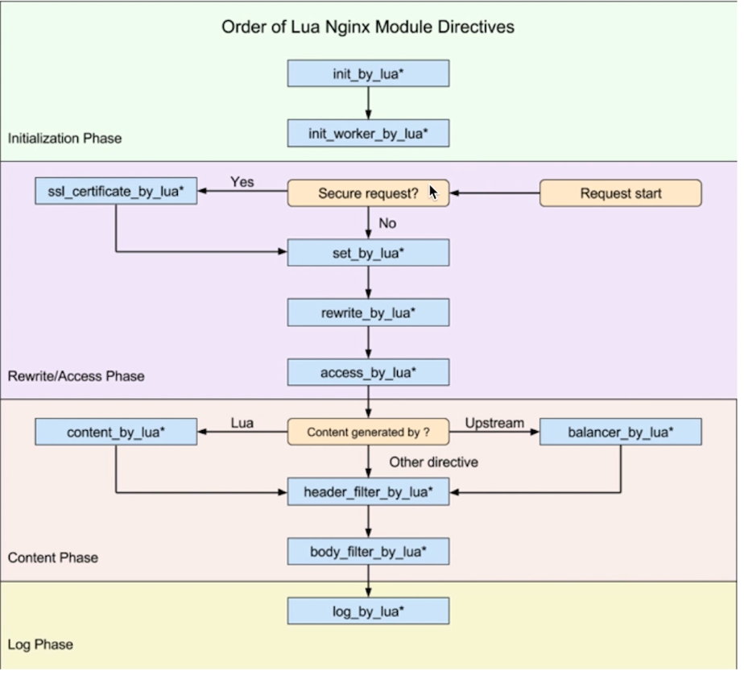

* init_by_lua：系统启动时调用
* init_worker_by_lua：worker进程启动时调用
* set_by_lua：Nginx变量用复杂lua return
* rewrite_by_lua：重写url规则
* access_by_lua：权限验证阶段
* content_by_lua：内容输出节点

#### OpenResty

* OpenResty有Nginx核心加很多第三方模块组成，默认集成了lua开发环境，使得Nginx可以作为一个web serve使用；
* 借助于Nginx的事件驱动模型和非阻塞IO，可以实现高性能的web应用程序；
* OpenResty提供了大量组件如Mysql、redis、memcached等等，使在Nginx上开发web应用更简单更方便。

#### OpenResty实践

* OpenResty hello world
* shared dic：共享内存字典，所有worker进程可见，lru淘汰
* OpenResty redis支持

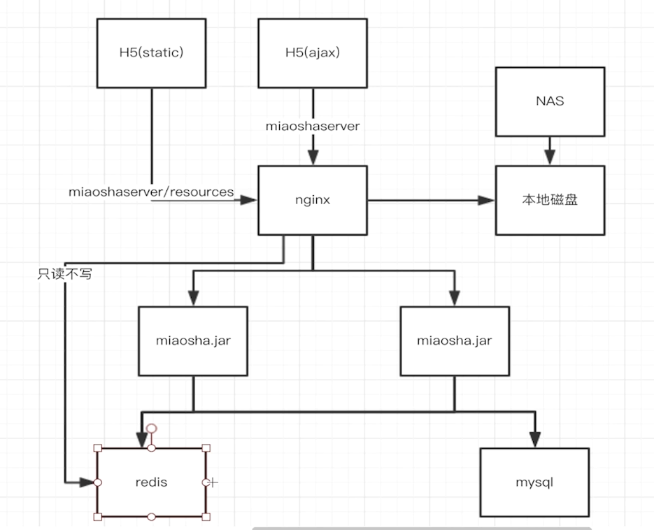

### 静态资源CDN加速

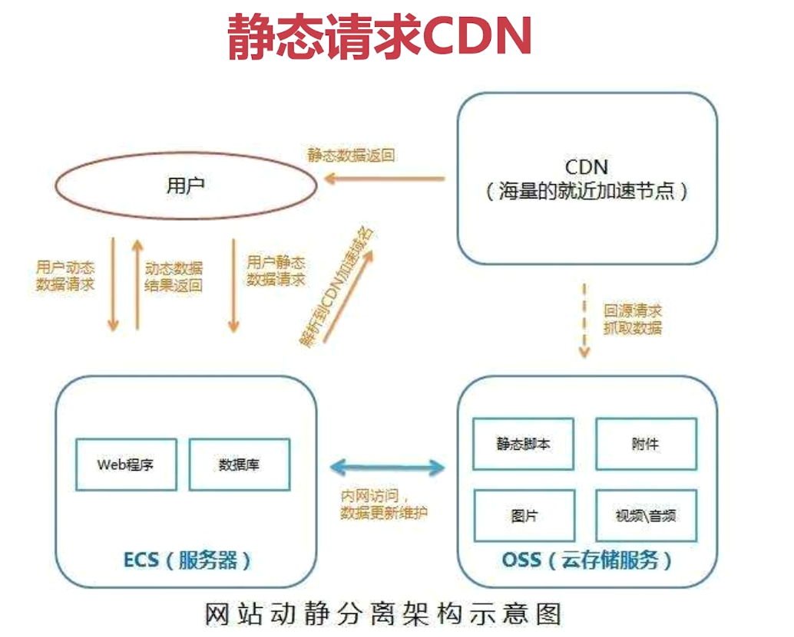

* DNS用CNAME解析到源站
* 回源缓存设置
* 强推失效

#### cache control响应头

* private：客户端可以缓存
* public：客户端和代理服务器都可以缓存
* max-age=xxx：缓存的内容将在xxx秒后失效
* no-cache：强制向服务端再验证一次（会将内容缓存起来，但下次要向服务端验证缓存是否能用）
* no-store：不缓存请求的任何返回内容

如何选择http请求头：
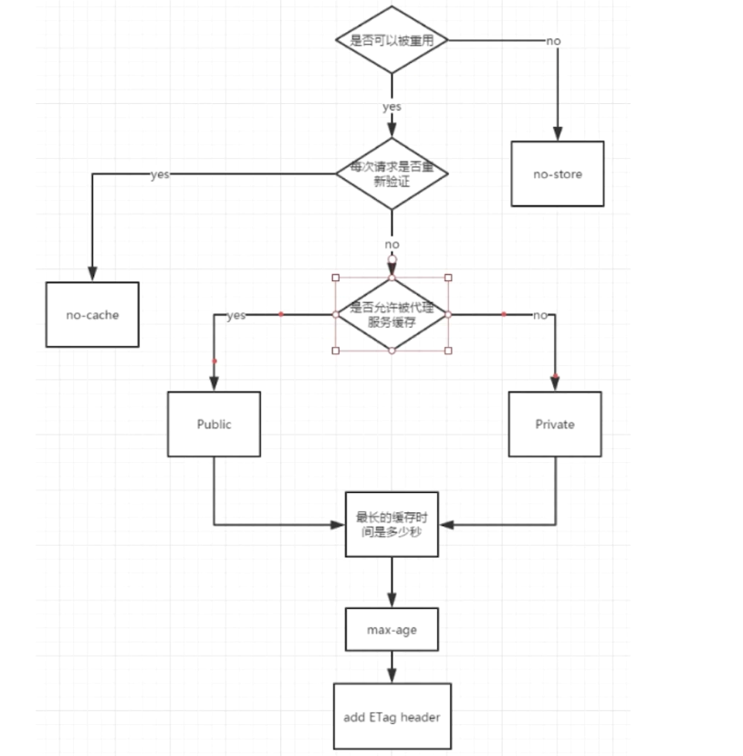

#### 有效性判断

* ETag：资源唯一标识
* If-None-Match：客户端发送的匹配Etag标识符

* Last-modified：资源最后被修改的时间
* If-Modified-Since：客户端发送的匹配资源最后修改时间的标识符

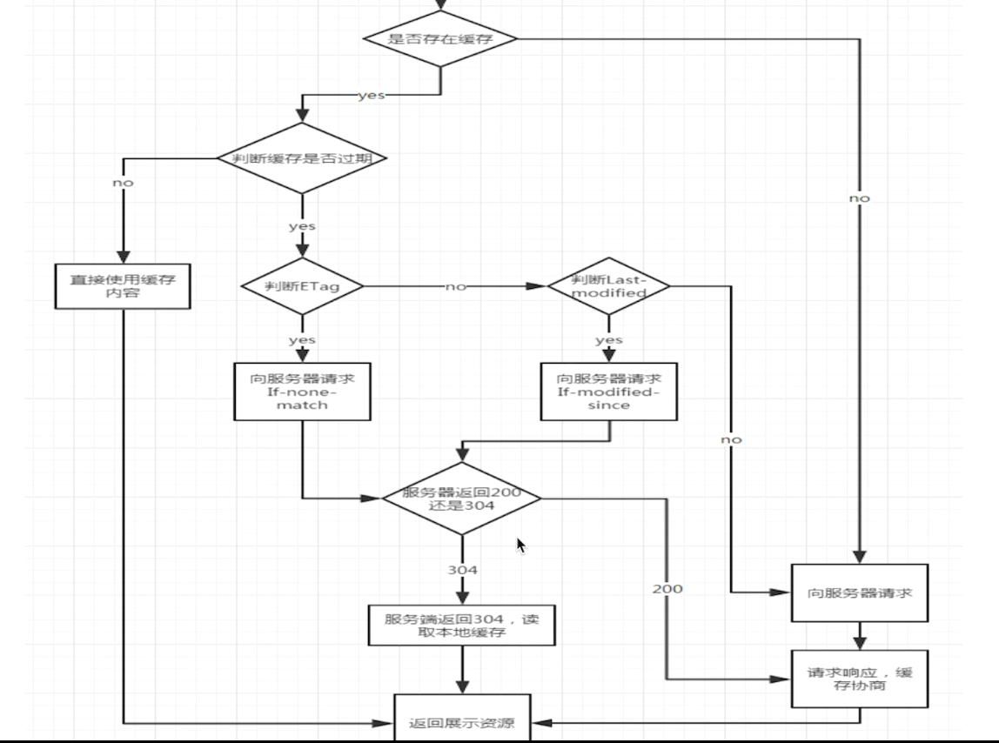

#### 浏览器三种刷新方式

* 回车刷新或a链接：看cache-control对应的max-age是否仍然有效，有效则直接from cache，弱cache-control中为no-cache，则进入缓存写上逻辑
* F5刷新或command+R刷新：去掉cache-control中max-age或直接设置max-age为0，然后进入缓存协商逻辑
* ctrl+F5或command+shift+R刷新：去掉cache-control和协商头，强制刷新

协商机制：比较Last-modified和Etag到服务端，若服务端判断没变化则304不返回数据，否则200返回数据

#### CDN自定义缓存策略

* 可自定义目录过期时间
* 可自定义后缀名过期时间
* 可自定义对应权重
* 可通过界面或api强制cdn对应目录刷新（非保成功且有数量限制）

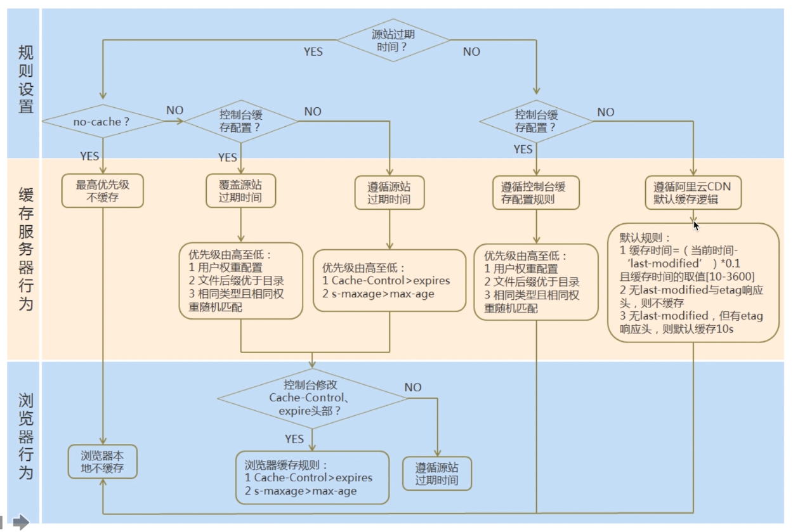

#### 静态资源部署策略（一）

* css，js，img等元素使用带版本号部署，例如a.js?v=1.0 不便利，且维护困难；
* css，js，img等元素使用带摘要部署，例如a.js?v=45edw，存在先部署html还是先部署资源的覆盖问题；
* css，js，img等元素使用摘要做文件名部署，例如45edw.js，新老版本并存且可回滚，资源部署完后再部署html

#### 静态资源部署策略（二）

* 对应静态资源保持生命周期内不会变，max-age可设置的很长，无视失效更新周期；
* html文件设置no-cache或较短max-age，以便于更新；
* html文件仍然设置较长的max-age，依靠动态的获取版本号请求发送到后端，异步下载最新的版本号的html后展示渲染在前端；

#### 静态资源部署策略（三）

* 动态请求也可以静态化成json资源推动到cdn上；
* 依靠异步请求获取后端节点对应资源状态做紧急下架处理；
* 可通过跑批紧急推送cdn内容以使其下架等操作；

当前部署结构：
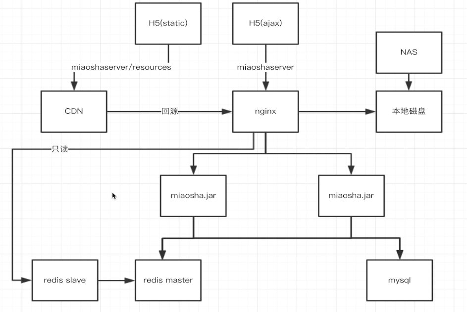

### 全页面静态化

定义：在服务端完成html，css，甚至js的load渲染成纯html文件后直接以静态资源的方式部署到cdn上。

#### phantomjs

* 无头浏览器，可以借助其模拟webkit js的执行

#### phantomjs应用

* 修改需要全页面静态化的实现，采用initView和hasInit方式防止多次初始化；
* 编写对应轮询生成内容方式；
* 将全静态化页面生成后推送到cdn；

## 交易性能优化

### 交易性能瓶颈

* 交易验证完全依赖数据库
* 库存行锁
* 后置处理逻辑

优化前的逻辑：
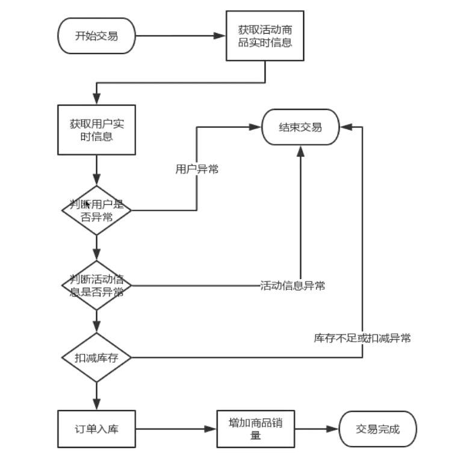

#### 交易验证优化

* 用户风控策略优化：策略缓存模型化
* 活动校验策略优化：引入活动发布流程，模型缓存化，紧急下线能力

#### 库存行锁优化

* 扣减库存缓存化
* 异步同步数据库
* 库存数据库最终一致性保证

方案：
1. 活动发布同步库存进缓存
2. 下单交易减缓存库存

注意：
在读取出商品的stock并将其存入redis缓存的时间内，商品是可能被售卖的，这种业务场景的一个解决方式是在活动开始之前下架商品，在活动开始时上架商品。不过为了简单起见代码中没有实现这种逻辑，默认在前面的操作期间库存不会变化。

问题：数据库记录不一致；

#### 异步同步数据库

方案：
1. 活动发布同步库存进缓存；
2. 下单交易减缓存库存；
3. 异步消息扣减数据库内库存；

#### 异步消息队列rocketmq

* 高性能，高并发，分布式消息中间件；
* 典型应用场景：分布式事务，异步解耦

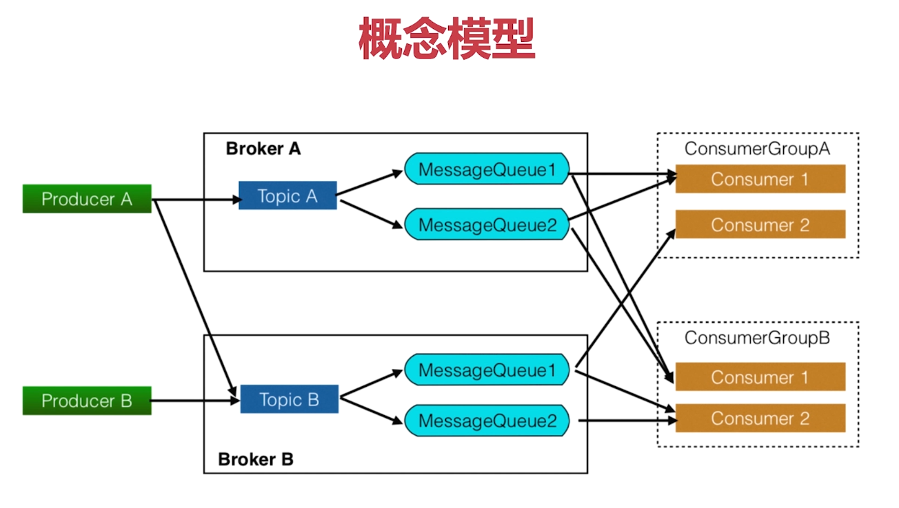

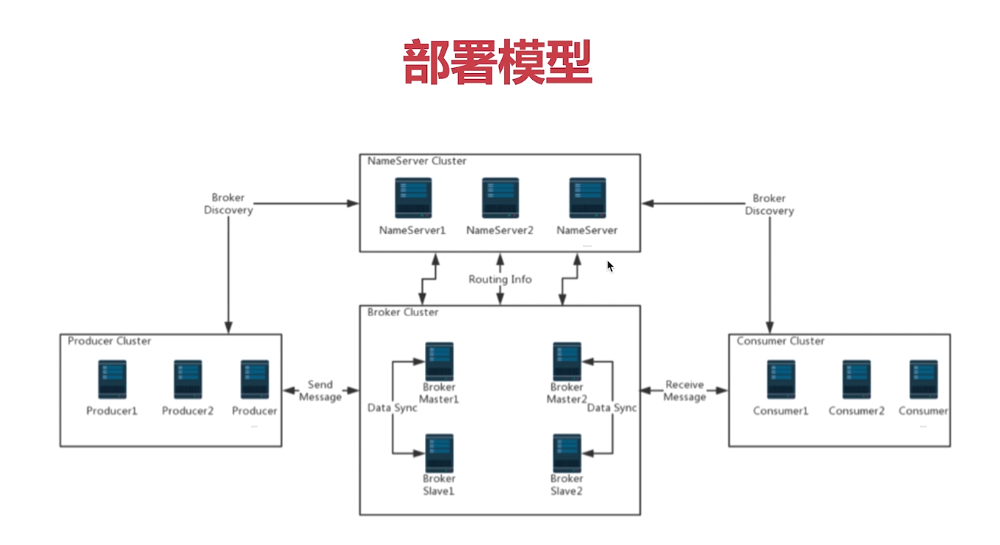

NameServer用来做服务发现，producer、consumer、broker都需要到nameserver上去注册。

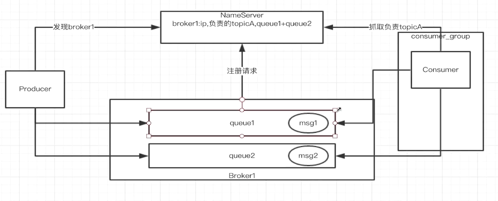

Consumer长轮询：没消息就等待，有消息就返回唤醒

应当尽量保证consumer group中consumer的数量与queue的数量近乎一致。

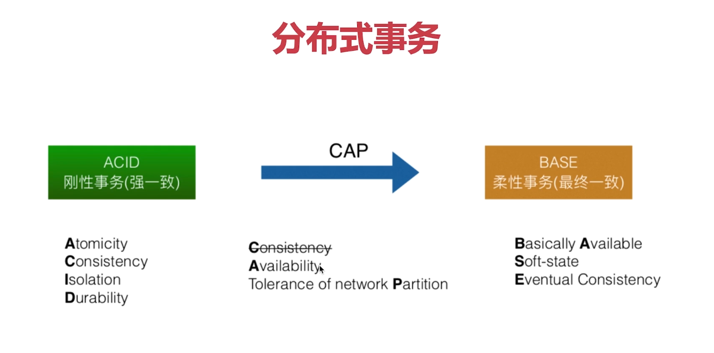

Soft-state: 瞬时的不一致性期间。

#### 异步同步数据库

问题：
1. 异步消息发送失败
2. 扣减操作执行失败
3. 下单失败无法正确回补库存

## 交易优化技术之事务型消息

Spring Transactional注解提供了在commit后的函数操作：
```java
TransactionSynchronizationManager.registerSynchronization(new TransactionSynchronizatior() {
    @Override
    public void afterCommit() {
        // 异步更新库存
        boolean mqResult = itemService.asyncDecreaseStock(itemId, amount);
        if(!mqResult) {
            itemService.increaseStock(itemId, amount);
            throw new BusinessException(EmBusinessError.MQ_SEND_ERROR);
        }
    }
})
```

问题在于这样做的话需要保证扣减库存消息必须执行成功，一旦失败，这条消息就永远丢失掉了。

### RocketMQ事务型消息

sendMessageInTransaction发出的消息一开始是prepare状态，不会被消费者看到，这个消息被维护在message broker中间件中，prepare状态会在本地去执行executeLocalTransaction方法，

```java
transactionMQProducer.setTransactionListener(new TransactionListener() {
    @Override
    public LocalTransactionState executeLocalTransaction(Message msg, Object arg) {
        // 真正要做的事，比如创建订单
        return null;
    }

    @Override
    publci local TransactionState checkLocalTransaction(MessageExt msg) {
        // 根据是否扣减库存成功，来判断要返回COMMIT，ROLLBACK还是继续UNKNOWN
        return null;
    }
});
```

消息中间件定期向producer回调checkLocalTranscation方法。

#### 操作流水

问题本质：没有库存操作流水。

数据类型：
* 主业务数据：master data
* 操作型数据：log data

#### 库存数据库最终一致性保证

方案：
1. 引入库存操作流水
2. 引入事务性消息机制

问题：
1. redis不可用时如何处理
2. 扣减流水错误如何处理

**业务场景决定高可用技术实现！**

设计原则：
* 宁可少买，不能超卖；

方案：
1. redis可以比实际数据库中少；
2. 超时释放；

### 库存售罄

* 库存售罄标识
* 售罄后不去操作后续流程
* 售罄后通知各系统售罄
* 回补上新

#### 后置流程

* **销量逻辑异步化（待实现）**

* 交易下单逻辑异步化
问题：
* 生成交易单sequence后直接异步返回；
* 前端轮询异步单状态

这是假异步，还需要依靠前端的loading bar。

## 流量削峰

问题：
* 秒杀下单接口会被脚本不停的刷
* 秒杀验证逻辑和秒杀下单接口强关联，代码冗余度高
* 秒杀验证逻辑复杂，对交易系统产生无关联负载

对用户和活动的验证都是在秒杀下单接口中做的，冗余度高，且浪费性能。

### 秒杀令牌原理

* 秒杀接口需要依靠令牌才能进入；
* 秒杀的令牌由秒杀活动模块负责生成；
* 秒杀活动模块对秒杀令牌生成全权处理，逻辑收口；
* 秒杀下单前需要先获得秒杀令牌；

问题：

* 秒杀令牌只要活动一开始就无限制生成，影响系统性能

#### 秒杀大闸原理

* 依靠秒杀令牌的授权原理定制化发牌逻辑，做到大闸功能
* 根据秒杀商品初始库存颁发对应数量令牌，控制大闸流量
* 用户风控策略前置到秒杀令牌发放中
* 库存售罄判断前置到秒杀令牌发放中

缺陷：
* 浪涌流量涌入后系统无法应对
* 多库存，多商品等令牌限制能力弱

#### 队列泄洪原理

* 排队有时候比并发更高效（例如redis单线程模型，innodb mutex key等）；
* 依靠排队去限制并发流量；
* 依靠排队和下游拥塞窗口程度调整队列释放流量大小；
* 支付宝银行网关队列举例

实现方案：
调用线程池的submit方法，比如设置一个拥塞窗口为20的等待队列，用来队列化泄洪

#### 泄洪方式：本地or分布式

* 本地：将队列维护在本地内存中
* 分布式：将队列设置到外部redis内

## 防刷限流技术

### 验证码

* 包装秒杀令牌前置，需要验证码来错峰
* 数学公式验证码生成器

### 限流目的

* 流量远比你想想的多
* 系统活着总比挂了要好
* 宁愿只让少数人能用，也不要让所有人不能用

### 限流方案

* 限并发
* 令牌桶算法
* 漏桶算法

#### 限流力度

* 接口维度
* 总维度

#### 限流范围

* 集群限流：依赖redis或其他的中间件技术做统一计数器，往往会产生性能瓶颈
* 单机限流：负载均衡的前提下单机平均限流效果更好

#### 限流实现

guava RateLimiter

### 防刷

* 排队，限流，令牌均只能控制总流量，无法控制黄牛流量

#### 传统防刷

* 限制一个会话（session_id，token）同一秒钟/分钟接口调用多少次：多会话接入绕开无效；
* 限制一个ip同一秒钟/分钟接口调用多少次：数量不好控制，容易误伤

#### 黄牛为什么难防

* 模拟器作弊：模拟硬件设备，可修改设备信息
* 设备牧场作弊：工作室里一批移动设备
* 人工作弊：靠佣金吸引兼职人员刷单

#### 设备指纹

* 采集终端设备各项参数，启动应用时生成唯一设备指纹；
* 根据对应设备指纹的参数猜测出模拟器等可疑设备概率；

#### 凭证系统

* 根据设备指纹下发凭证
* 关键业务链路上带上凭证并有业务系统到凭证服务器上验证
* 凭证服务器根据对应凭证锁等价的设备指纹参数并根据实时行为风控系统判定对应凭证的可疑度分数
* 若分数低于某个数值则由业务系统返回固定错误码，拉起前端验证码验身，验身成功后加入凭证服务器对应分数

## 课程总结

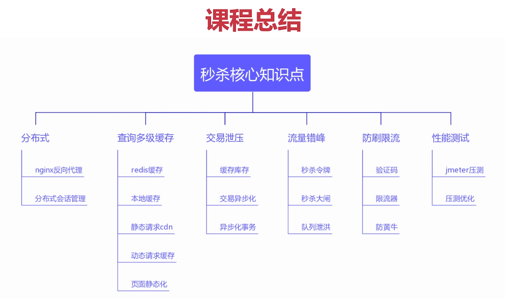

## 后续成长建议

* 活学活用，思考更多应用场景
* 在工作和项目中运用技术，训练能力
* 继续深入细节
* 多沟通交流

## 分布式会话存储策略

有空看一下Redis cluster

### 会话有效期

* Tomcat默认为30m
* 不与服务端发生交互的呆滞时间

### 会话续命

* 触发操作延长生命周期
* 延长到30m，而不是加30m（Redis需要自己实现

### 安全性管理

* url query string，get请求参数内
* 自定义header内
* 用安全传输的https
* 自定义协议

### 强登录态与弱登录态

* 强登录态（需要登录，比如下单时需要用户id
* 无需登录（比如浏览商品详情
* 弱登录态（比如游客身份，同时可以处理待登录和已登录两种状态

#### 弱登录态

* 千人千面的智能推荐
* 续命能力

##### 续命能力

* 请求续命
* keepalive续命

### SSO单点登录（Single Site On

* 同域名
* 根域名相同子域名不同
* 域名都不相同

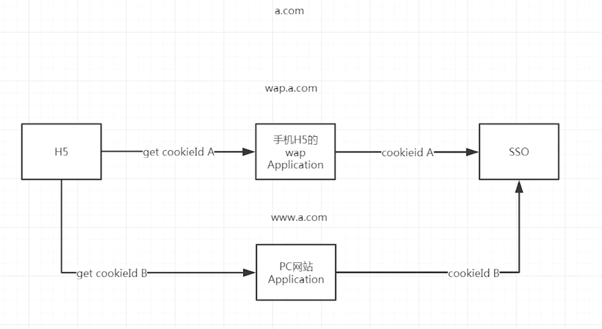

#### 同域名

同域名情况下只需要保证SSO是同一台服务器就可以。

#### 根域名相同子域名不同

```
httpOnly=false/true
domain=/
```

#### 域名都不相同

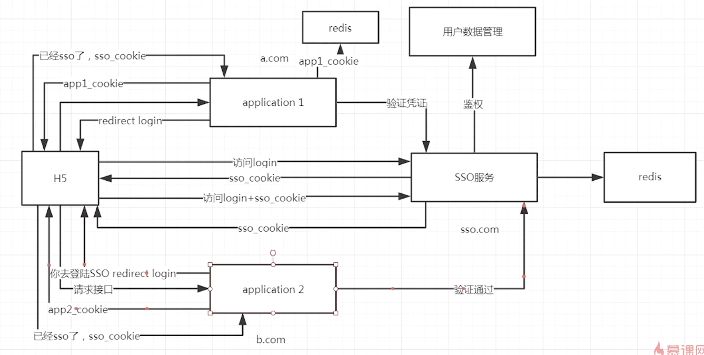

## MySQL性能优化

### MySQL应用性能提升

通用性能优化口诀：
* 缓存
* 异步
* 批处理

* 写操作：批量insert，批量update
* 读操作：索引

#### MySQL批量写

* for each{insert into table values(1)}
* Execute once insert into table values (1), (2), (3), (4)...;

#### MySQL批量写优势

* sql编译n次和1次的时间与空间复杂度
* 网络消耗的时间复杂度
* 磁盘寻址的复杂度

### MySQL单机优化性能提升

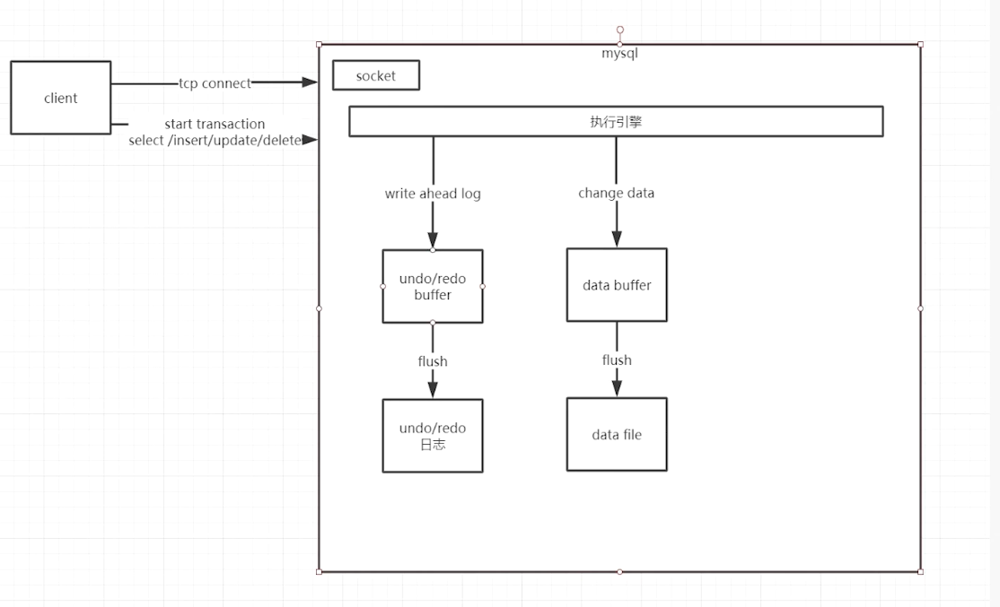

* max_connection=1000
* innodb_file_per_table=1
* innodb_buffer_pool_size=1G
* innodb_log_file_size=256M
* innodb_log_buffer_size=16M
* **innodb_flush_log_at_trx_commit=2**需要放在[mysqld_safe]节点下
* innodb_data_file_path=ibdata1:1G;ibdata2:1G;ibdata3:1G:autoextend

### MySQL分布式性能优化

主从扩展

#### MySQL主从

* 开启bin_log
* 设置主从同步账号，配置主从同步

##### 搜索功能

* 模糊查询 where name like '%龙虾%'
* 搜索引擎（比如ElasticSerach